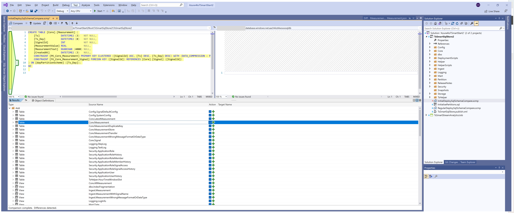
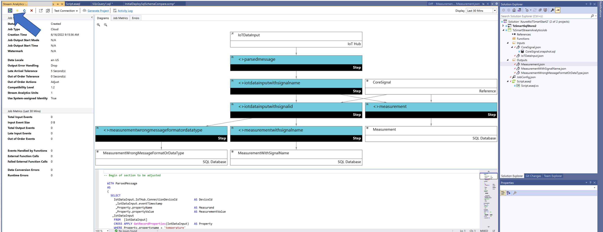

Setup - IoT solutions using Azure IoT Hub, Azure Stream Analytics and Azure SQL
=======================================================================
<br/>


- [Setup - IoT solutions using Azure IoT Hub, Azure Stream Analytics and Azure SQL](#setup---iot-solutions-using-azure-iot-hub-azure-stream-analytics-and-azure-sql)
- [Setup and operate the solution](#setup-and-operate-the-solution)
- [Development environment](#development-environment)
- [Get access to the code](#get-access-to-the-code)
- [Install Azure Services](#install-azure-services)
  - [Prepare data database](#prepare-data-database)
    - [Set Active Directory admin](#set-active-directory-admin)
    - [Deploy the database schema to your database](#deploy-the-database-schema-to-your-database)
    - [Create Users in the database](#create-users-in-the-database)
    - [Initialize partitions](#initialize-partitions)
    - [Define (default) behaviour of Measurand(s)](#define-default-behaviour-of-measurands)
  - [Optionally: Prepare the Azure IoT hub and Raspberry-pi emulator](#optionally-prepare-the-azure-iot-hub-and-raspberry-pi-emulator)
  - [Optionally: Configure the Raspberry Pi sample application](#optionally-configure-the-raspberry-pi-sample-application)
  - [Modify Stream Analytics project](#modify-stream-analytics-project)
    - [Configure Stream Analytics Storage Account](#configure-stream-analytics-storage-account)
    - [Define connection information of Inputs](#define-connection-information-of-inputs)
      - [CoreSignal](#coresignal)
      - [IoTDataInput](#iotdatainput)
    - [Define connection information of Outputs](#define-connection-information-of-outputs)
    - [Adjust the Stream Analytics Query](#adjust-the-stream-analytics-query)
    - [Test the Strem Analytics query](#test-the-strem-analytics-query)
    - [Submit the Strem Analytics project to Azure](#submit-the-strem-analytics-project-to-azure)
  - [Test your system](#test-your-system)
  - [Setup Database Maintenance Jobs](#setup-database-maintenance-jobs)


<br/>

# Setup and operate the solution #

The following steps are required to setup the solution:
- Install the necessary development tools
- Get access to the code
- Install Azure Services (Azure Stream Analytics and Azure SQL Database)
- Deploy SQL Database schema
- Initialize partitions
- Deploy Stream Analytics Jobs

Version: 2.003


After the initial setup some maintenance activities should be executed to keep the system in an optimal shape.

# Development environment #

The solution is currently only compatible with Visual Studio 2019 and 2022.

When using Visual Studio 2019 make sure the following toolset is installed:


When using Visual Studio 2022 make sure the following packages are installed:


# Get access to the code #

This chapter describes how to deploy the source code into the created Azure components from the step before.

Before starting with the deployment, please make sure that the Azure services have been deployed and the necessary tool pre-requisites have been installed on your local machine.

Clone the following GitHub repository to your local computer:

```
git clone https://github.com/meinradweiss/Azure4IoTSmartStart2Public
```

**The GitHub repository is currently private, please reach out to the repository owner to get access.**

# Install Azure Services #

The following button deploys the core infrastructure into your chosen subscription.

[](https://portal.azure.com/#create/Microsoft.Template/uri/https%3A%2F%2Fraw.githubusercontent.com%2Fyaens%2Farm-templates%2Fmaster%2Fstartsmart%2FazuredeployBasic.json)


For the custom deployment, the following parameters need to be defined:
- **Region**: Select your designated Azure Region, make sure to pick a region which supports the necessary components (e.g. West Europe)
- **Unique Solution Prefix**: Pick a unique string for your solution. The name must be between 3 and 17 characters in length and use numbers and lower-case letters only.<br/> The prefix will be appended at the front of your Azure services. <br/>It is helpful, if it relates somehow to your project and it is the part of the object names that makes them unique.
  - Example: <br/> 
    Unique Solution Prefix: **ch4iot4wsxxx** -> Azure IotHub: **ch4iot4wsxxx**hub, Azure SQL Server: **ch4iot4wsxxx**sqlserver, ...
- **Sql Administrator Login**: pick a username for your SQL administrator (don't use a "well known name" like, sa, admin, manager, ...)
- **Sql Administrator Login Password**: define a strong password for your SQL administrator. It has to include small letters, capital letters, a number and a special character. More details to the [Azure SQL Password Policy](https://docs.microsoft.com/en-us/sql/relational-databases/security/password-policy?view=azuresqldb-current).  
- **Sql Firewall Start IP**: Add the public IP of your computer to this field, for testing purposes you can use ```0.0.0.0```
- **Sql Firewall End IP**: Add the public IP of your computer to this field, for testing purposes you can use ```255.255.255.255```

If you would like to deploy the services from you local machine you can find the arm templates and a supporting deployment script in the ```infrastructure``` folder.

## Prepare data database ##

### Set Active Directory admin ###

Assign your AAD identity as the Active Directory admin of the Azure SQL Server. Locate your new created Azure SQL Server in the azure portal and click [Azure Active Directory] in the [Settings] section.


Don't forget to press the [Save] button.
<br/>
<br/>

### Deploy the database schema to your database ###

Open the solution in Visual Studio and then open the SchemaCompare file: **InitialDeploySqlSchemaCompare.scmp**. Configure the target database -> point it to your Azure SQL database. Press the [Compare], check the differences and press [Update]
<br/>




<br/>

For any further updates you should use the SchemaCompare file: **RegularDeploySqlSchemaCompare.scmp**


### Create Users in the database ###

Create the database user(s) to allow Azure Stream Analytics to connect to the database, read meta data ([Core].[Signal]) and write telemetry data.

The recommended way is to work with the managed identity of Stream Analytics. But currently Visual Studio does not allow to use managed identities in the project file. You can change the connection properties after deploying the solution to Azure.

If you would like to setup SQL users based on the managed identity, then you must login to the SQL database with an Azure AD user identity. This requires, that you are either Azure Active Directory admin on your database server or that some created a user with your Azure AD identity.

    -- Managed Identity
    CREATE USER [aaadeletemewstreamanalytics] FROM EXTERNAL PROVIDER; 
    GRANT SELECT ON OBJECT::[Core].[Signal] TO [aaadeletemewstreamanalytics];
    GRANT SELECT, INSERT ON SCHEMA::INGEST TO [aaadeletemewstreamanalytics];
    
    -- Database User
    CREATE USER [ASA_MetaDataReader]   WITH PASSWORD = 'your strong password 8fdKdd$nlNv3049jsKK';
    CREATE USER [ASA_TelemetryWriter]  WITH PASSWORD = 'your strong password 8fdKsd3$nlNv3049jsZZ';

    GRANT SELECT ON OBJECT::[Core].[Signal] TO [ASA_MetaDataReader];
    GRANT SELECT, INSERT ON SCHEMA::INGEST  TO [ASA_TelemetryWriter];

<br/>


### Initialize partitions ###
A key aspect of the solution is the fact that the large tables are partitioned. The solution just contains one partition border with the value '1900-01-01 00:00:00'. The first step after deploying the solution to the database is to create the real partitions which matches to the data that will be stored in the database. <br/>
The stored procedure [Partition].[MaintainPartitionBorders] can be used to do an initial setup and it must be scheduled to adjust the borders on a regular basis. Azure Data Factory or Azure Synapse Analytics Pipelines can be used to setup the scheduled execution.
<br/>


<br/>

**Stored Procedure: [Partition].[MaintainPartitionBorders]**

Creates "empty" partitions for dayPartion and monthPartition Schema/Function. If no parameters are provided, then it will start with the first day of the current month and create partitions for this and the following month.

| Parameter | Data Type | Has<br>default<br>value | Default Value | Purpose |
| :---      | :---:     | :---:                   | :---:         | :---     |
| @startDate | DATETIME | 1      | "today" | Specifies the start day to maintain the partition borders. The stored procedure takes this date and then calculates the first day of the corresponding month to define the real start date. |
| @dayAheadNumber | INT | 1 |  35    | The number of days that are added to the current day. The system seeks then forward to the first day of the next month. <br/> e.g. @startDate = '2021-09-07', <br/>the current date is '2021-09-29' and  @dayAheadNumber int = 35 <br/>-> Partitions from 2021-09-01 to 2021-12-01 will be created, <br/> for the dayPartion Schema/Function and also for the monthPartition Schema/Function |

If you would like to load historical data to the database, then you should specify the @startDate parameter. It should be set to the first date of the historical data.<br/>
Otherwise, if you work on a new project and you are collecting data starting from today, then you can just execute the procedure [Partition].[MaintainPartitionBorders] without any parameters.

    EXEC [Partition].[MaintainPartitionBorders]

<br/>
<br/>
<br/>


### Define (default) behaviour of Measurand(s) ###
The table [Core].[Signal] stores the list of all reference signals and they provide the context for all stored Measurement data. Beside of that context they also steer the behaviour of the system via the values of the two attributes [UpdateLatestMeasurement] and [SetCreatedAt].


-  [UpdateLatestMeasurement] -> Update [Core].[LatestMeasurement] 
<br/>
The table [Core].[LatestMeasurement] stores the latest known value of a Signal. This is very useful if you build a dashboard on top of the database to visualize the current state. Maintaining this table generates additional work for the database. That's the reason why the feature is disabled per default. If the last value of a signal should be maintained in the table [Core].[LatestMeasurement], then the **[UpdateLatestMeasurement]** of the corresponding Signal in the table [Core].[Signal] must be set to 1 (true).
Setting the attribute to 1 will not only change the attribute value but also add an entry in the [Core].[LatestMeasurement] table and scans [Core].[AllMeasurement] to find the last know value. If the database already contains a lot of rows, then this process can thake a while. For that reason it is recommended to change not a lot of records in one transaction. 
<br/>

- [SetCreatedAt] -> Set [Core].[Measurement\<xyz>].[CreatedAt]
<br/>
The attribute [CreatedAt] can optionally store the point in time when the record is stored in the database. If this information is stored with each Measurement, then the required storage space witll grow, but it is possible to analyse the latency of the whole chain (Time between the event is generated and the time when it arrives in the database). Also this feature is per default disabled and it can be enabled by changing the value of the attribute [SetCreatedAt] in the table [Core].[Signal] to 1 (true).
<br/>

If new signals are registered, then the values of [UpdateLatestMeasurement] and [SetCreatedAt] are 0 (false). If there are measurands for which you would like to change the default behaviour, then you do that by adding the measurand and the desired values for [UpdateLatestMeasurement] and [SetCreatedAt] in the table [Config].[SignalDefaultConfig].
<br/>
<br/>
<br/>


## Optionally: Prepare the Azure IoT hub and Raspberry-pi emulator  ##

If you don't have an existing Azure IoT hub with devices already generating events, then you can create your own device and generate your own telemetry data. <br/>

Open in the azure portal your Azure IoT hub and create a new device: 


<br/>
After the device creation click on the link of your new device and get the primary connection string. It will be required in the configuration of Raspberry Pi sample application
<br/>

<br/>


## Optionally: Configure the Raspberry Pi sample application ##

https://azure-samples.github.io/raspberry-pi-web-simulator/


<br/>


    /*
    * IoT Hub Raspberry Pi NodeJS - Microsoft Sample Code - Copyright (c) 2017 - Licensed MIT
    */
    const wpi = require('wiring-pi');
    const Client = require('azure-iot-device').Client;
    const Message = require('azure-iot-device').Message;
    const Protocol = require('azure-iot-device-mqtt').Mqtt;
    const BME280 = require('bme280-sensor');

    const BME280_OPTION = {
      i2cBusNo: 1, // defaults to 1
      i2cAddress: BME280.BME280_DEFAULT_I2C_ADDRESS() // defaults to 0x77
    };

    const connectionString = 'HostName=<YourHub>.azure-devices.net;DeviceId=<YourDeviceName>;SharedAccessKey=<YourKey>';
    const LEDPin = 4;

    var sendingMessage = false;
    var messageId = 0;
    var client, sensor;
    var blinkLEDTimeout = null;

    function getMessage(cb) {
      messageId++;
      sensor.readSensorData()
        .then(function (data) {
          cb(JSON.stringify({
            messageId: messageId,
            deviceId: 'Raspberry Pi Web Client',
            temperature: data.temperature_C,
            humidity: data.humidity,
            eventTimestamp: (new Date()).toISOString()
          }), data.temperature_C > 30);
        })
        .catch(function (err) {
          console.error('Failed to read out sensor data: ' + err);
        });
    }

    function sendMessage() {
      if (!sendingMessage) { return; }

      getMessage(function (content, temperatureAlert) {
        var message = new Message(content);
        message.properties.add('temperatureAlert', temperatureAlert.toString());
        console.log('Sending message: ' + content);
        client.sendEvent(message, function (err) {
          if (err) {
            console.error('Failed to send message to Azure IoT Hub');
          } else {
            blinkLED();
            console.log('Message sent to Azure IoT Hub');
          }
        });
      });
    }

    function onStart(request, response) {
      console.log('Try to invoke method start(' + request.payload + ')');
      sendingMessage = true;

      response.send(200, 'Successully start sending message to cloud', function (err) {
        if (err) {
          console.error('[IoT hub Client] Failed sending a method response:\n' + err.message);
        }
      });
    }

    function onStop(request, response) {
      console.log('Try to invoke method stop(' + request.payload + ')');
      sendingMessage = false;

      response.send(200, 'Successully stop sending message to cloud', function (err) {
        if (err) {
          console.error('[IoT hub Client] Failed sending a method response:\n' + err.message);
        }
      });
    }

    function receiveMessageCallback(msg) {
      blinkLED();
      var message = msg.getData().toString('utf-8');
      client.complete(msg, function () {
        console.log('Receive message: ' + message);
      });
    }

    function blinkLED() {
      // Light up LED for 500 ms
      if(blinkLEDTimeout) {
          clearTimeout(blinkLEDTimeout);
      }
      wpi.digitalWrite(LEDPin, 1);
      blinkLEDTimeout = setTimeout(function () {
        wpi.digitalWrite(LEDPin, 0);
      }, 500);
    }

    // set up wiring
    wpi.setup('wpi');
    wpi.pinMode(LEDPin, wpi.OUTPUT);
    sensor = new BME280(BME280_OPTION);
    sensor.init()
      .then(function () {
        sendingMessage = true;
      })
      .catch(function (err) {
        console.error(err.message || err);
      });

    // create a client
    client = Client.fromConnectionString(connectionString, Protocol);

    client.open(function (err) {
      if (err) {
        console.error('[IoT hub Client] Connect error: ' + err.message);
        return;
      }

      // set C2D and device method callback
      client.onDeviceMethod('start', onStart);
      client.onDeviceMethod('stop', onStop);
      client.on('message', receiveMessageCallback);
      setInterval(sendMessage, 500);  //2000
    });


## Modify Stream Analytics project ##

### Configure Stream Analytics Storage Account ###

Stream Analytics needs a storage account to get reference data from SQL Server. The definition of the storage account is stored in the file **JobConfig.json**. The storage account definitions are located in the [Global Storage Settings] tab.


<br/>

### Define connection information of Inputs ###

The following tho inputs must be adjusted to your environment: CoreSignal, IoTDataInput

#### CoreSignal ####

Define the connection to your SQL Server using the user ASA_MetaDataReader. You can switch to the managed identity, as soon as the solution is deployed to Stream Analytics.


#### IoTDataInput ####

Define the connection to your IoTHub


<br/>
<br/>

### Define connection information of Outputs ###

The following tho outputs must be adjusted to your environment: Measurement, MeasurementWithSignalName, MeasurementWrongMessageFormatOrDataType

Specify the connection string to your database server and specify the user ASA_TelemetryWriter while you are using visual studio to test. After deploying the solution to stream Analytics you can change it to the managed identity.


<br/>
<br/>

### Adjust the Stream Analytics Query ###

Modify the query, that it fits to your message. You only need to adjust the piece in the block 'section to be adjusted'

<br/>


| Column | Purpose | Example |
| :---      |  :--- | :-- | 
| Ts | Timestamp of the point in time, when the event happend. The value should using UTC. | |
| DeviceId | Name of the device sending the event | Device01 |
| Measurand | Name of the object/property measured | Temperatur |
| SignalName | String that identifies a signal. Concatination of DeviceId and "_" and Measurand | Device01_Temperatur |
| MeasurementValue | Numeric value of the measurement (integer and floating point) | 23.56 |
| MeasurementText | Alphanumeric value of the measurement | closed |
| SourceTS | Original value of the attribute which is used to get the attribute Ts from. No conversation to a data time data type is applied. -> useful to debug query. | |
 | SourceMeasurementValue | Original value of the attribute which is used to get the attribute  MeasurementValue from. No conversation to a numeric type is applied. -> useful to debug query. | |
| SourceMeasurementText | Original value of the attribute which is used to get the attribute  Measurementtext from. -> useful to debug query. | |
| SourceMessage | Whole message used to get the described attribute above. -> useful to debug query. If the original message is duplicated using a cross apply function then the result set may be huge and in this case it's better to provide just a null value. | |

<br/>


If you are using the Raspberry Pi sample application to generate the IoT events, then you can use the following script to parse the message. 


JSON message of Raspberry Pi sample application arriving in Stream Analytics

    [
      {
        "messageId": 28,
        "deviceId": "Raspberry Pi Web Client",
        "temperature": 30.873242697428207,
        "humidity": 64.30382371344649,
        "eventTimestamp": "2022-06-19T15:15:11.828Z",
        "EventProcessedUtcTime": "2022-06-19T15:18:00.2546003Z",
        "PartitionId": 1,
        "EventEnqueuedUtcTime": "2022-06-19T15:15:12.1430000Z",
        "IoTHub": {
          "MessageId": null,
          "CorrelationId": null,
          "ConnectionDeviceId": "MySampleDevice001",
          "ConnectionDeviceGenerationId": "637912483866782845",
          "EnqueuedTime": "2022-06-19T15:15:12.1520000Z"
        }
      },
    …
    ]


There is a GitHub sample project (https://github.com/meinradweiss/StreamAnalyticsQuery) that may be helpful if you would like to parse your own messages.


    -- Begin of section to be adjusted

    WITH ParsedMessage
    AS
    (
      SELECT
        IotDataInput.IoTHub.ConnectionDeviceId          AS DeviceId
        ,IotDataInput.eventTimestamp
        ,Property.propertyName                         AS Measurand
        ,Property.propertyValue                        AS MeasurementValue
      ,IotDataInput
        FROM  [IotDataInput]
        CROSS APPLY GetRecordProperties(IotDataInput)   AS Property
        WHERE Property.propertyname = 'temperature'
          OR Property.propertyname = 'humidity'
    
    )
    
    ,IoTDataInputWithSignalName  
    AS
    (
    
      SELECT 
        TRY_CAST(eventTimestamp AS DATETIME)                            AS [Ts]
        ,DeviceId                                                       AS [DeviceId]
        ,Measurand                                                      AS [Measurand]
        ,CONCAT(DeviceId, '_', Measurand)                               AS [SignalName]
        ,TRY_CAST([MeasurementValue] AS FLOAT)                          AS [MeasurementValue]
        ,CASE WHEN TRY_CAST([MeasurementValue] AS FLOAT) IS NULL 
                                                THEN [MeasurementValue]  
                                      ELSE NULL 
          END                                                            AS [MeasurementText]
        ,eventTimestamp                                                 AS [SourceTS]
        ,[MeasurementValue]                                             AS [SourceMeasurementValue]
        ,[MeasurementValue]                                             AS [SourceMeasurementText]
        
        ,IotDataInput                                                   AS [SourceMessage]
      FROM [ParsedMessage]
    )

    -- End of section to be adjusted


### Test the Strem Analytics query ###

Visual Studio allow you to test the solution. If you would like to test it with real telemetry data then start your Raspberry Pi application and use [Run Locally] with the following settings.


After a few seconds you will see the following window. The warning is expected, because currently there are no signals registered in the database. They will be registered automatically, as soon as we feed data to the database.


As soon as the job is running, you can see the some key counters.


And the [Stream Analytics Local Run Results] shows you the exposed dataset


<br/>

### Submit the Strem Analytics project to Azure ###

The last step is to deploy the solution to Azure using the [Submit to Azure] button. Just select the deployed Stream Analytics job name and press the [Submit] button.


<br/>

After you submitted the job to Azure you must start it. This can be done either directly in Visual Studio:



Or in the Azure portal.


## Test your system ##

Make sure that events are submitted to your IotHub. If you are using the Raspberry Pi sample application, then press run

Execute in your SQL Server database the stored proecdure [Core].[GetOverviewOfDataInDatabase]<br/>

    exec [Core].[GetOverviewOfDataInDatabase]


## Setup Database Maintenance Jobs ##

To keep the system at an optimal performance there is some housekeeping required. You find more details in the following document. [MaintainDatabase](TsSmartSqlStore2_20_MaintainDatabase.md)


