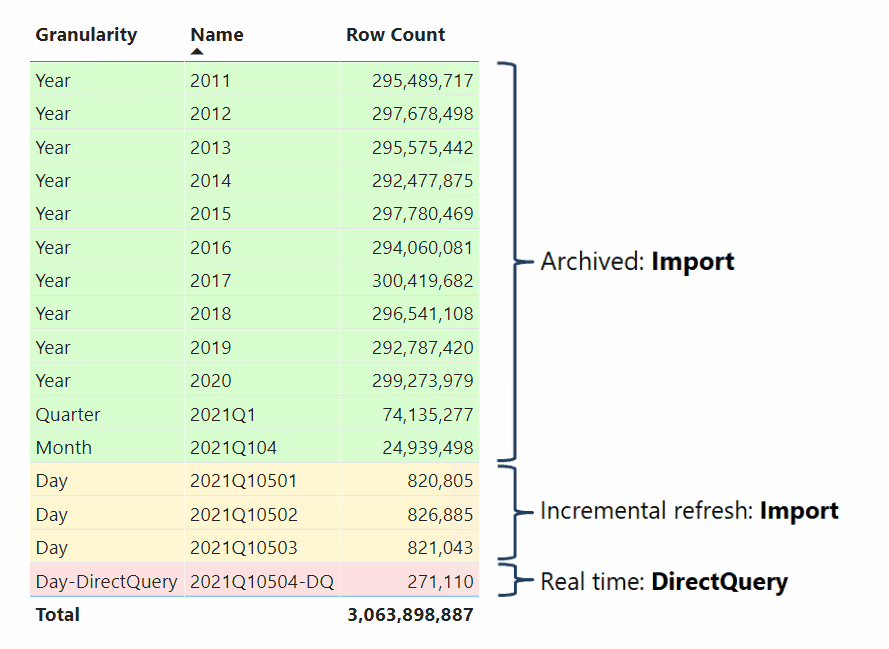

Query - IoT solutions using Azure IoT Hub, Azure Stream Analytics and Azure SQL
=======================================================================
 

- [Query - IoT solutions using Azure IoT Hub, Azure Stream Analytics and Azure SQL](#query---iot-solutions-using-azure-iot-hub-azure-stream-analytics-and-azure-sql)
- [Querying the database](#querying-the-database)
  - [Otimal SQL queries](#otimal-sql-queries)
  - [Relative time windows, time zone selection and Power BI dynamic M parameter support](#relative-time-windows-time-zone-selection-and-power-bi-dynamic-m-parameter-support)
  - [Power BI hybird tables](#power-bi-hybird-tables)

 

# Querying the database # 

## Otimal SQL queries ##

Most of the queries sent to an IoT database are looking for Measurement values for a specific Signal and a specified time window. 
If the where condition of the SQL query filters on Ts_day, then SQL Server has the option to do partition elimination and to speed up query processing. 
A query which specifies the concrete time window and the corresponding filter on Ts_Day may look like this.

    declare @FromTs   DATETIME = '2021-12-11 12:37:57.119'
          ,@ToTs     DATETIME = '2021-12-11 13:37:57.119'
          ,@SignalId INT       = 1

    SELECT *
    FROM  [Core].[AllMeasurement]
    WHERE [SignalId] = @SignalId
        AND [Ts_Day] >= CONVERT(DATE, @FromTs) 
        AND [Ts_Day] <= CONVERT(DATE, @ToTs)  AND [Ts]     >= @FromTs
        AND [Ts]     <= @ToTs

 

The function [Mart].[GetMeasurementForSignal] help you to run such queries without the need to care about the additionl filter.

    CREATE FUNCTION [Mart].[GetMeasurementForSignal] 
      (  @SignalId INT
        ,@FromTs   DATETIME2(3) 
        ,@ToTs     DATETIME2(3) 
        
      )
    RETURNS TABLE
    AS 
    RETURN 

      SELECT *
      FROM  [Core].[AllMeasurement]
      WHERE [SignalId] = @SignalId
        AND [Ts_Day] >= CONVERT(DATE, @FromTs) 
        AND [Ts_Day] <= CONVERT(DATE, @ToTs) 
        AND [Ts]     >= @FromTs
        AND [Ts]     <= @ToTs

You have just to specify the SignalId and the time range you are looking for and the function takes care on the rest.

    SELECT * 
    FROM [Mart].[GetMeasurementForSignal]   
                (1 
               ,'2021-12-11 12:37:57.119'
               ,'2021-12-11 13:37:57.119')

 
 

## Relative time windows, time zone selection and Power BI dynamic M parameter support ##

 

A more sophisticated function is [Mart].[GetMeasurementForRelativeTimeWindow]. It allow you to:  

* specify the size of the window your are looking for (e.g. 1 Hour, 2 Days, ...)
  * Supported window sizes
    * 'MINUTE'
    * 'HOUR'
    * 'DAY'
    * 'MONTH'
    * 'YEAR' 
 
* the end of time window
* the time zone that you would like to see results hin
  
This function can also be used in conjunction with Power BI and dynamic M parameters.

[Power BI dynamic M parameter](https://docs.microsoft.com/en-us/power-bi/connect-data/desktop-dynamic-m-query-parameters)

 

    CREATE FUNCTION [Mart].[GetMeasurementForRelativeTimeWindow] 
      (  @DeltaTime       VARCHAR(25)
        ,@EndDateTime     DATETIME2(3) 
      ,@DefaultTimeZone VARCHAR(50) = 'Central European Standard Time' 
      )
    RETURNS TABLE
    AS 
    RETURN 

    With [GetMeasurement]
    as
    (
      SELECT [Ts]                                                                                                AS [Ts_UTC]
            ,CONVERT(DATETIME2(3),CONVERT(DATETIMEOFFSET, [Ts]) AT TIME ZONE @DefaultTimeZone)                   AS [Ts]
            ,[Ts_Day]                                                                                            AS [Ts_Day_PartitionKey_UTC]
            ,[SignalId]
            ,[MeasurementValue]
            ,[MeasurementText]
            ,CONVERT(DATE, Ts)                                                                                   AS [Ts_Day_UTC]
        -- CONVERT(VARCHAR(12) is required to be able to zoom in PowerBI below seconds
            ,CONVERT(VARCHAR(12), CONVERT(TIME(3), Ts, 121))                                                     AS [Ts_Time_UTC]
        ,CONVERT(DATE,        CONVERT(DATETIMEOFFSET, [Ts]) AT TIME ZONE @DefaultTimeZone)                   AS [Ts_Day]
        -- CONVERT(VARCHAR(12) is required to be able to zoom in PowerBI below seconds
        ,CONVERT(VARCHAR(12), CONVERT(time(3), CONVERT(DATETIMEOFFSET, [Ts]) AT TIME ZONE @DefaultTimeZone)) AS [Ts_Time]

      FROM  [Core].[AllMeasurement]
        CROSS JOIN [Mart].[GetRelativeTimeWindow] (@DeltaTime, @EndDateTime, @DefaultTimeZone)
      WHERE [Ts_Day] >= [UtcTs_DayStartDate] 
        AND [Ts_Day] <= [UtcTs_DayEndDate]
        AND [Ts]     >= [UtcStartDateTime]
        AND [Ts]     <= [UtcEndDateTime]
    )
    select 
            [Ts_UTC]
        ,[Ts]
        ,[Ts_Day_PartitionKey_UTC]
        ,[SignalId]
          ,[MeasurementValue]
          ,[MeasurementText]
        
        ,[Ts_Day_UTC]
        ,[Ts_Time_UTC]

        ,[Ts_Day]
        ,[Ts_Time]
        ,LEFT([Ts_Time],2) AS [Ts_Hour]
        ,SUBSTRING([Ts_Time],4,2) AS [Ts_Minute]
        ,SUBSTRING([Ts_Time],7,2) AS [Ts_Second]
        ,SUBSTRING([Ts_Time],10,3) AS [Ts_Millisecond]
    from [GetMeasurement]

## Power BI hybird tables ##

Hybrid tables allow you to have historical data loaded to the Power BI dataset and using direct query to get reatime data. 

[Hybrid Tables in Power BI Premium](https://powerbi.microsoft.com/en-my/blog/announcing-public-preview-of-hybrid-tables-in-power-bi-premium/)

Hybrid tables in Power BI Premium offers the following benefits:

* Blazing fast performance in import mode – The import-mode partitions deliver extremely fast query performance as the data imported during data refresh is readily available in local memory to answer client queries.
* Latest updates from the data warehouse always included – DirectQuery requests are sent to the data source, so the query results include the latest data updates. The performance depends on how long the data source takes to respond with the results, but the queries are faster if only a small slice of the data is queried, such as data updates that occurred after the last refresh time.
* Better resource utilization especially for very large datasets – With the latest data updates available in real-time, fewer data refreshes are needed to pick up latest changes. With fewer refresh cycles consuming your Premium capacity resources, more of these resources are available to deliver a good report performance and user experience. You no longer need to refresh your datasets at a very high cadence if the data in the data warehouse changes frequently!
* Incremental refresh policies with real time support – Incremental refresh applies a sophisticated partitioning scheme in import mode so that refreshes complete much, much faster than if you imported the entire data volume into a single table partition every time. Despite this complexity, however, it is relatively straightforward to configure an incremental refresh policy in Power BI Desktop. The report creator does not require any partitioning skills. And now, with hybrid tables, report creators can easily add a DirectQuery partition to get the latest data in real time as well. Just configure incremental refresh as usual and enable the Get the latest data in real time with DirectQuery (Premium only) checkbox!

 

The attributte [Ts_Day] can be used slice the data to the corresponding partitions. It is the partition key attriubte and allow SQL Server to select the data in an efficient way.
