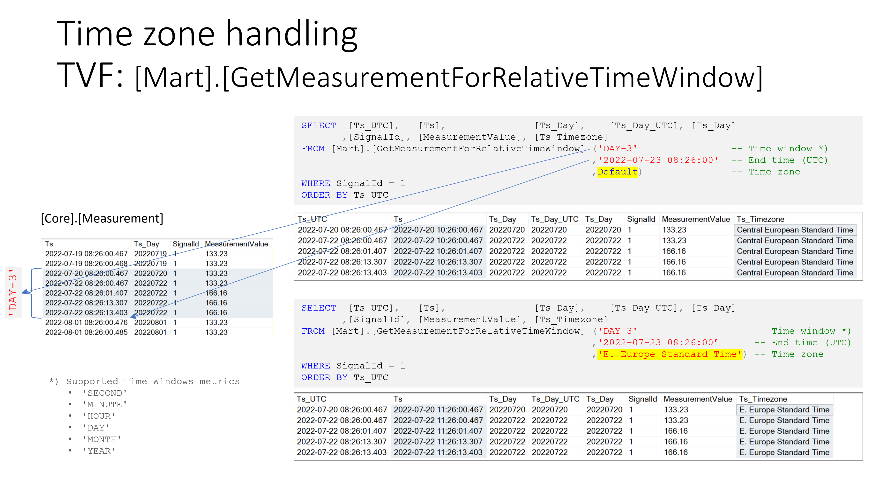

Query - IoT solutions using Azure IoT Hub, Azure Stream Analytics and Azure SQL
=======================================================================
 

- [Query - IoT solutions using Azure IoT Hub, Azure Stream Analytics and Azure SQL](#query---iot-solutions-using-azure-iot-hub-azure-stream-analytics-and-azure-sql)
- [Querying the database](#querying-the-database)
  - [Optimal SQL queries](#optimal-sql-queries)
  - [Relative time windows and time zone selection](#relative-time-windows-and-time-zone-selection)

 

# Querying the database # 

## Optimal SQL queries ##

Most of the queries sent to an IoT database are looking for Measurement values for a specific Signal and a specified time window. 
If the where condition of the SQL query filters on Ts_day, then SQL Server has the option to do partition elimination and to speed up query processing. 
A query which specifies the concrete time window and the corresponding filter on Ts_Day may look like this.

    declare @FromTs   DATETIME = '2021-12-11 12:37:57.119'
           ,@ToTs     DATETIME = '2021-12-11 13:37:57.119'
           ,@SignalId INT       = 1

    SELECT *
    FROM  [Core].[AllMeasurement]
    WHERE [SignalId] = @SignalId
        AND [Ts_Day] >= CONVERT(DATETIME, CONVERT(DATE, @FromTs))  
        AND [Ts_Day] <= CONVERT(DATETIME, CONVERT(DATE, @ToTs))   
        AND [Ts]     >= @FromTs
        AND [Ts]     <= @ToTs

 

The function [Mart].[GetMeasurementForSignal] help you to run such queries without the need to care about the additional filter.

    CREATE FUNCTION [Mart].[GetMeasurementForSignal] 
      (  @SignalId INT
        ,@FromTs   DATETIME2(3) 
        ,@ToTs     DATETIME2(3) 
        
      )
    RETURNS TABLE
    AS 
    RETURN 

      SELECT *
      FROM  [Core].[AllMeasurement]
      WHERE [SignalId] = @SignalId
        AND [Ts_Day] >= CONVERT(DATETIME, CONVERT(DATE, @FromTs)) 
        AND [Ts_Day] <= CONVERT(DATETIME, CONVERT(DATE, @ToTs)) 
        AND [Ts]     >= @FromTs
        AND [Ts]     <= @ToTs

You have just to specify the SignalId and the time range you are looking for and the function takes care on the rest.

    SELECT * 
    FROM [Mart].[GetMeasurementForSignal]   
                (1 
               ,'2021-12-11 12:37:57.119'
               ,'2021-12-11 13:37:57.119')

 
 

## Relative time windows and time zone selection ##

 

A more sophisticated function is [Mart].[GetMeasurementForRelativeTimeWindow]. 

It allow you to:  

* specify the size of the window your are looking for (e.g. 1 Hour, 2 Days, ...)
  * Supported window sizes
    * 'SECOND'
    * 'MINUTE'
    * 'HOUR'
    * 'DAY'
    * 'MONTH'
    * 'YEAR' 
 
* the end of time window
* the time zone that you would like to see results hin
  
This function can also be used in conjunction with Power BI and dynamic M parameters. -> see [Querying data using Power BI](docs/TsSmartSqlStore2_60_PowerBI.md)

