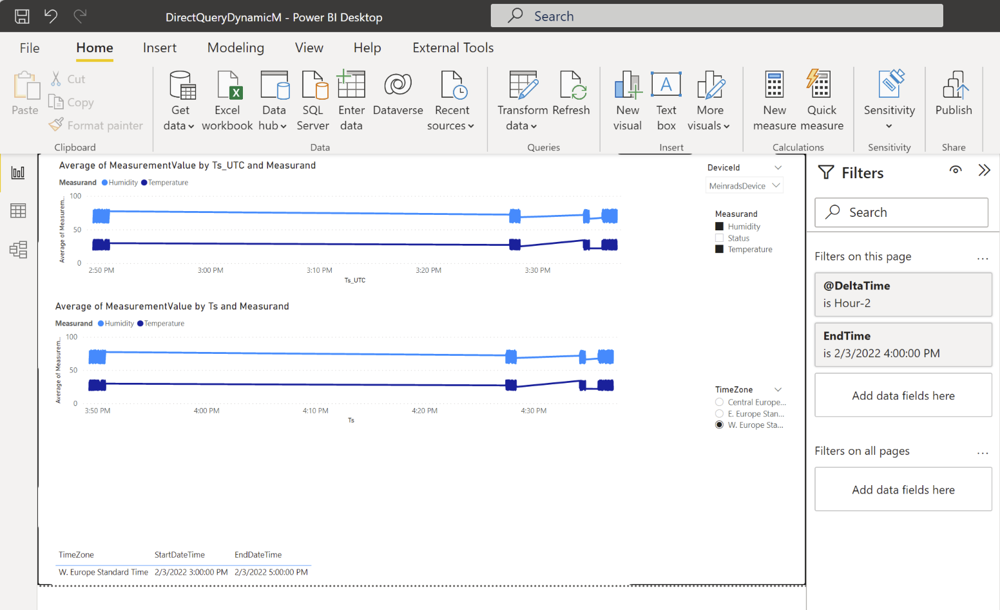
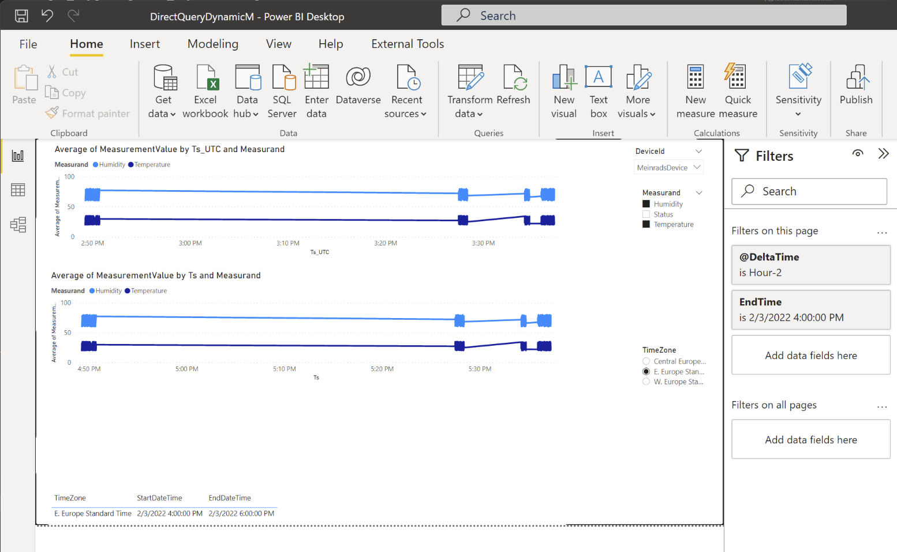

Query - Database using Power BI
=======================================================================
 

- [Query - Database using Power BI](#query---database-using-power-bi)
- [Schema MartPowerBI](#schema-martpowerbi)
  - [Timezone handling from Power BI](#timezone-handling-from-power-bi)
  - [Relative time windows, time zone selection and Power BI dynamic M parameter support](#relative-time-windows-time-zone-selection-and-power-bi-dynamic-m-parameter-support)
  - [Power BI hybrid tables](#power-bi-hybrid-tables)

 

# Schema MartPowerBI # 

## Timezone handling from Power BI ##

The view [MartPowerBI].[Measurement] provides timestamps 1:1 as they are stored in the [Core] tables. This attributes are labeled with _UTC (e.g. [Measurement].[Ts] -> [Measurement].[Ts_UTC],  [Measurement].[Ts_Day] -> [Measurement].[Ts_Day_UTC]).
The "original" columns will provide the corresponding value recalculated in the time zone of the database. If you don't specify the desired time zone in the [Config].[SystemConfig] table then 'Central European Standard Time' will be used as a default.

 

 

If you are reading data from the Azure SQL Database using the table valued function [Mart].[GetMeasurementForRelativeTimeWindow] then you can specify the timezone in wich the timestamps should be presented via the parameter: @TargetTimeZone
 

 

 

## Relative time windows, time zone selection and Power BI dynamic M parameter support ##

 

The table valued function [Mart].[GetMeasurementForRelativeTimeWindow]. Allow you not only to specify the time zone in which you would like to get data from. You can also specify the time window that you would like to see.
 

 

The parameter @EndDateTime_UTC is used to specify the upper (end) time of the window you are looking for. And the parameter @DeltaTime the size of the window.

* Supported window sizes are:
  * 'SECOND'
  * 'MINUTE'
  * 'HOUR'
  * 'DAY'
  * 'MONTH'
  * 'YEAR' 
 
* the end of time window
* the time zone that you would like to see results hin

 
 

This function can also be used in conjunction with Power BI and dynamic M parameters.

[Power BI dynamic M parameter](https://docs.microsoft.com/en-us/power-bi/connect-data/desktop-dynamic-m-query-parameters)

 

This Power BI sample report shows how the time window can be selected via Filters and how the time zone can be adjusted.

Western Europe Standard Time

Eastern Europe Standard Time

The M code looks like this

    let
        Source = Sql.Databases("<mydbserver>.database.windows.net"),
        mewiot99sqldb = Source{[Name="mewiot99sqldb"]}[Data],
        Mart_GetMeasurementForRelativeTimeWindow = mewiot99sqldb{[Schema="Mart",Item="GetMeasurementForRelativeTimeWindow"]}[Data],
        #"Invoked FunctionMart_GetMeasurementForRelativeTimeWindow" = Mart_GetMeasurementForRelativeTimeWindow(DeltaTime,EndDateTime,SqlTimeZone),
        #"Filtered Rows" = Table.SelectRows(#"Invoked FunctionMart_GetMeasurementForRelativeTimeWindow", each true)
    in
        #"Filtered Rows"

 

## Power BI hybrid tables ##

Hybrid tables allow you to have historical data loaded to the Power BI dataset and using direct query to get real-time data. 

[Hybrid Tables in Power BI Premium](https://powerbi.microsoft.com/en-my/blog/announcing-public-preview-of-hybrid-tables-in-power-bi-premium/)

Hybrid tables in Power BI Premium offers the following benefits:

* Blazing fast performance in import mode – The import-mode partitions deliver extremely fast query performance as the data imported during data refresh is readily available in local memory to answer client queries.
* Latest updates from the data warehouse always included – DirectQuery requests are sent to the data source, so the query results include the latest data updates. The performance depends on how long the data source takes to respond with the results, but the queries are faster if only a small slice of the data is queried, such as data updates that occurred after the last refresh time.
* Better resource utilization especially for very large datasets – With the latest data updates available in real-time, fewer data refreshes are needed to pick up latest changes. With fewer refresh cycles consuming your Premium capacity resources, more of these resources are available to deliver a good report performance and user experience. You no longer need to refresh your datasets at a very high cadence if the data in the data warehouse changes frequently!
* Incremental refresh policies with real time support – Incremental refresh applies a sophisticated partitioning scheme in import mode so that refreshes complete much, much faster than if you imported the entire data volume into a single table partition every time. Despite this complexity, however, it is relatively straightforward to configure an incremental refresh policy in Power BI Desktop. The report creator does not require any partitioning skills. And now, with hybrid tables, report creators can easily add a DirectQuery partition to get the latest data in real time as well. Just configure incremental refresh as usual and enable the Get the latest data in real time with DirectQuery (Premium only) checkbox!

 

The attribute [Ts_Day] can be used slice the data to the corresponding partitions. It is the partition key attribute and allow SQL Server to select the data in an efficient way.
