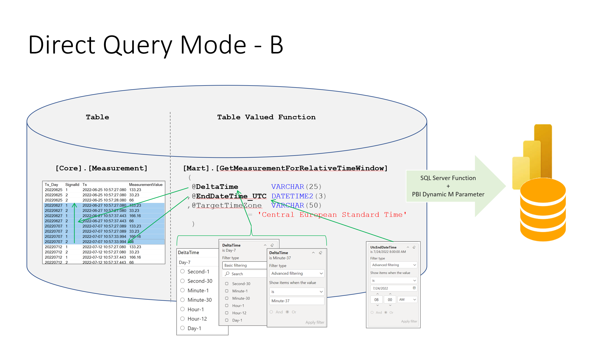

Query - Database using Power BI
=======================================================================
 

- [Query - Database using Power BI](#query---database-using-power-bi)
- [General way to create Power BI reports on top of (telemetry) data)](#general-way-to-create-power-bi-reports-on-top-of-telemetry-data)
- [Database Schema MartPowerBI](#database-schema-martpowerbi)
  - [Time zone handling from Power BI](#time-zone-handling-from-power-bi)
- [Power BI Tempates](#power-bi-tempates)
  - [IoTStartDirectQuery.pbit: Direct Query](#iotstartdirectquerypbit-direct-query)
  - [IoTStartRelativeWindow.pbit: Relative time windows, time zone selection and Power BI dynamic M parameter support](#iotstartrelativewindowpbit-relative-time-windows-time-zone-selection-and-power-bi-dynamic-m-parameter-support)
  - [IoTStartHybridTable.pbit: Power BI hybrid tables](#iotstarthybridtablepbit-power-bi-hybrid-tables)

 

# General way to create Power BI reports on top of (telemetry) data)

There are several ways how you can use Power BI to visualize/analyse IoT data.

|Mode        | Benefit | Remarks |
| :---      | :---     | :---     |
| Import Mode | Very Fast reports, full Power BI functionality | No real time data visible. Dataset must be refreshed to see new data| 
| Hybrid Mode | Fast reports, Historical data are using 'Import Mode' and real time data are collected via direct query | Power BI functionality is limited to 'Direct Query Mode'. Requires Power BI premium. |
| Direct Query Mode | Real time data will be available, without the need of Power BI premium | Potentially high pressure on the SQL Server side. It is important, that partition elimination can kick in and that indexes can be used by SQL Server. There are several ways to achieve this goal. Two of them (IoTStartDirectQuery.pbit, IoTStartRelativeWindow.pbit) are available as Power BI templates.   Only limited functionality |

 
The following templates are provided as starting point. 

|Template        | Description | Remarks |
| :---      | :---     | :---     |
| IoTStartDirectQuery.pbit | Uses TsDay dimension to slice data according to partitions | This report is using direct query. It can be switched to 'Import Mode'.
| IoTStartRelativeWindow.pbit | Also this report works with direct query. You can specify the time window via a windows size and an window end date. It allows you also to specify the time zone in which timestamps should be displayed. ||
| IoTStartHybridTable.pbit | This report uses the Power BI hybrid mode. -> it requires Power BI premium. ||
 
 

# Database Schema MartPowerBI # 

The schema MartPowerBI contains views which are tailored  for Power BI. A power BI report can use them 1:1 to build the nucleus of the dataset.

|View        | Purpose | Description |
| :---      | :---     | :---     |
|Measurement | Fact    | Telemetry data from all data in [Core].[AllMeasurement].   Timestamp values are available in _UTC and configured local time.  |
| Signal | Dimension | List of signals stored in [Core].[Measurement] |
| TsDay | Dimension | List days/partitions with potentially  data. This dimension should be used to filter days of interest. SQL Server can then use it and apply partition elimination.  |
| LatestMeasurement | Fact | List of the available latest measurement values ([Core].[LatestMeasurement]) |
| Timezone | Lookup | Value of the currently configured time zone. |

 

The following diagram shows how "table" can be related. All relationships are defined as 1:* and with the option "Assume referential integrity", to allow Power BI to generate inner joins.

 

## Time zone handling from Power BI ##

The view [MartPowerBI].[Measurement] provides timestamps 1:1 as they are stored in the [Core] tables. This attributes are labeled with _UTC (e.g. [Measurement].[Ts] -> [Measurement].[Ts_UTC],  [Measurement].[Ts_Day] -> [Measurement].[Ts_Day_UTC]).
The "original" columns will provide the corresponding value recalculated in the time zone of the database. If you don't specify the desired time zone in the [Config].[SystemConfig] table then 'Central European Standard Time' will be used as a default.

 

 

If you are reading data from the Azure SQL Database using the table valued function [Mart].[GetMeasurementForRelativeTimeWindow] then you can specify the time zone in wich the timestamps should be presented via the parameter: @TargetTimeZone
 

 
 

# Power BI Tempates # 

## IoTStartDirectQuery.pbit: Direct Query ##

This template uses the following parameters. You have to provide the according vaules when you open the template the first time.

| Parameter | Value | Comment |
| :---      | :---  | :---    |
| DatabaseServerURL | 'yourServerName'.database.windows.net ||
| DatabaseName | 'yourDatabaseName' ||

 

Use of the TsDay dimension to filter the time window presented in the report.

 
Data model of Direct query report.

 
 

## IoTStartRelativeWindow.pbit: Relative time windows, time zone selection and Power BI dynamic M parameter support ##

This template uses the following parameters. You have to provide the according values when you open the template the first time.

| Parameter | Value | Comment |
| :---      | :---  | :---    |
| DatabaseServerURL | 'yourServerName'.database.windows.net ||
| DatabaseName | 'yourDatabaseName' ||
| DeltaTime | Day-1 | Should be adjusted to your data volume. |
| UTCEndDateTime | 31/12/9999 23:59:59 | Don't use another date. |
| TimeZone | Central European Standard Time | Adjust to your desired timezone. Valid are SQL Server time zones. |

 

On the report the time window size can be used in a filter control. It allow the user to choose from the predefined list of Window sizes. The window end is in this case always the current time.

 

With Power BI filters the user can 'construct' its own time window size and also specify the end time of the window.

 

The table valued function [Mart].[GetMeasurementForRelativeTimeWindow]. Allow you not only to specify the time zone in which you would like to get data from. You can also specify the time window that you would like to see.
 

 

The parameter @EndDateTime_UTC is used to specify the upper (end) time of the window you are looking for. And the parameter @DeltaTime the size of the window.

* Supported window sizes are:
  * 'SECOND'
  * 'MINUTE'
  * 'HOUR'
  * 'DAY'
  * 'MONTH'
  * 'YEAR' 
 
* the end of time window
* the time zone that you would like to see results

 
 

This function can also be used in conjunction with Power BI and dynamic M parameters.

[Power BI dynamic M parameter](https://docs.microsoft.com/en-us/power-bi/connect-data/desktop-dynamic-m-query-parameters)

 

The database provides the required table valued function [Mart].[GetMeasurementForRelativeTimeWindow] to use the dynamic M parameter functionality of Power BI.

Mapping of the parameters.

The M code looks like this

    let
        Source = Sql.Databases("<mydbserver>.database.windows.net"),
        mewiot99sqldb = Source{[Name="mewiot99sqldb"]}[Data],
        Mart_GetMeasurementForRelativeTimeWindow = mewiot99sqldb{[Schema="Mart",Item="GetMeasurementForRelativeTimeWindow"]}[Data],
        #"Invoked FunctionMart_GetMeasurementForRelativeTimeWindow" = Mart_GetMeasurementForRelativeTimeWindow(DeltaTime,EndDateTime,SqlTimeZone),
        #"Filtered Rows" = Table.SelectRows(#"Invoked FunctionMart_GetMeasurementForRelativeTimeWindow", each true)
    in
        #"Filtered Rows"

 

## IoTStartHybridTable.pbit: Power BI hybrid tables ##

Hybrid tables allow you to have historical data loaded to the Power BI dataset and using direct query to get real-time data. 

[Hybrid Tables in Power BI Premium](https://powerbi.microsoft.com/en-my/blog/announcing-public-preview-of-hybrid-tables-in-power-bi-premium/)

Hybrid tables in Power BI Premium offers the following benefits:

* Blazing fast performance in import mode – The import-mode partitions deliver extremely fast query performance as the data imported during data refresh is readily available in local memory to answer client queries.
* Latest updates from the data warehouse always included – DirectQuery requests are sent to the data source, so the query results include the latest data updates. The performance depends on how long the data source takes to respond with the results, but the queries are faster if only a small slice of the data is queried, such as data updates that occurred after the last refresh time.
* Better resource utilization especially for very large datasets – With the latest data updates available in real-time, fewer data refreshes are needed to pick up latest changes. With fewer refresh cycles consuming your Premium capacity resources, more of these resources are available to deliver a good report performance and user experience. You no longer need to refresh your datasets at a very high cadence if the data in the data warehouse changes frequently!
* Incremental refresh policies with real time support – Incremental refresh applies a sophisticated partitioning scheme in import mode so that refreshes complete much, much faster than if you imported the entire data volume into a single table partition every time. Despite this complexity, however, it is relatively straightforward to configure an incremental refresh policy in Power BI Desktop. The report creator does not require any partitioning skills. And now, with hybrid tables, report creators can easily add a DirectQuery partition to get the latest data in real time as well. Just configure incremental refresh as usual and enable the Get the latest data in real time with DirectQuery (Premium only) checkbox!

 

This template uses the following parameters. You have to provide the according values when you open the template the first time.

| Parameter | Value | Comment |
| :---      | :---  | :---    |
| DatabaseServerURL | 'yourServerName'.database.windows.net ||
| DatabaseName | 'yourDatabaseName' ||
| RangeStart | 01/01/2000 00:00:00 | Don't use another date. |
| RangeEnd   | 31/12/9999 23:59:59 | Don't use another date. |

 

The partition key in the database is built on an INT data type. Hybrid tables are internally working with DateTime types. The function DataKey is used to translate the DateTime values to Int values.

You can adjust how much data that you would like to load to the model.

